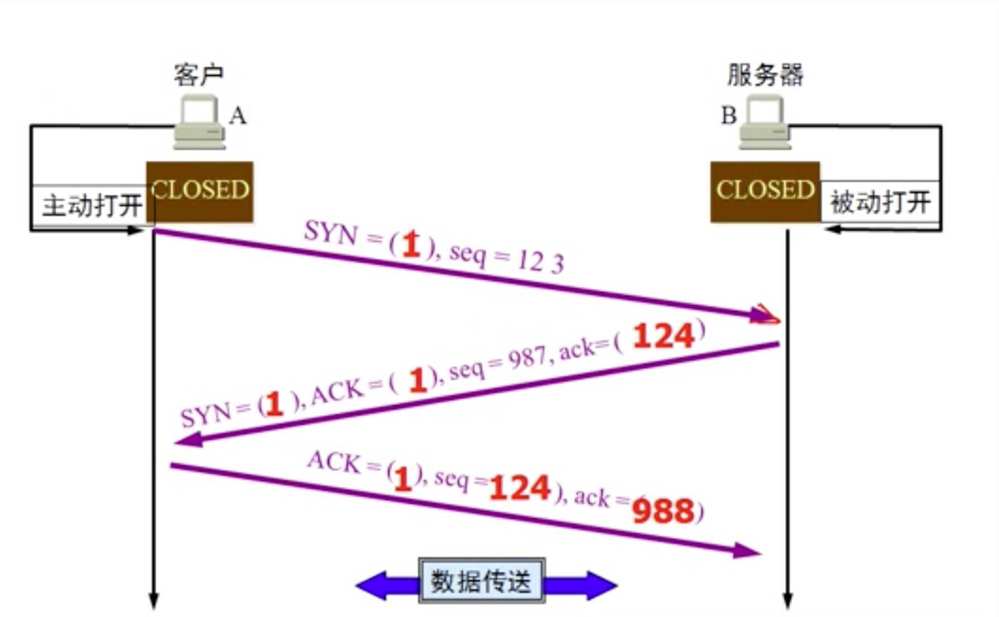
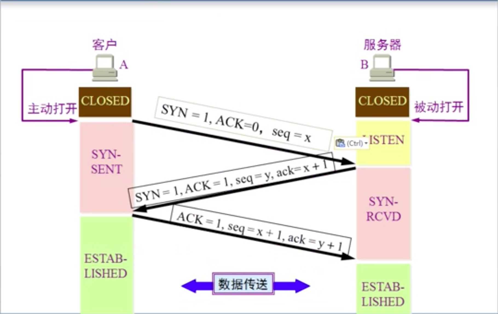
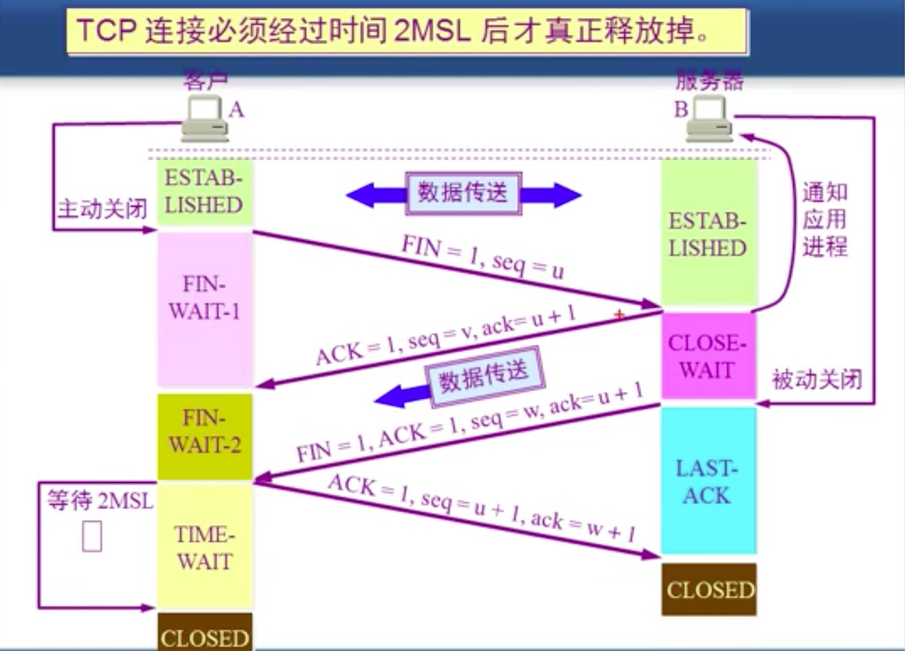

# TCP的连接和释放

syn: 是否是同步包

ack: 确认号;

seq: 序列号

#### 问: tcp为什么要三次握手?

答:假设第一次握手的数据包选择了一条较远的链路, 等了一段时间发现A计算机发现没有收到确认, 隔了一段时间又发送了一个数据包,而这次很快就收到了确认, B计算机在此时又收到了第一次发送的确认包, 这次又给了一个A计算机的确认包, 由于A计算机已经收到了一次确认数据包, 所以就不会再次确认B计算机发送的确认包, 由于A计算机一直不确认第二次发送的数据包, 所以B计算机就会一直等待, 导致B计算机的连接浪费, 浪费多了就瘫痪了

tcp四次挥手

#### 问: 为什么要等待2MSL 时间?

答: 因为在服务器发送关闭通知的时候, 如果发送失败, 在发送一次的时候客户端立即关闭了的话就再也不能给服务端确定了, 然后连接就处于抑制不能关闭的状态