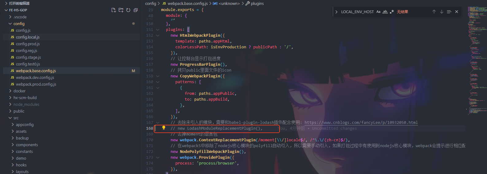

### antd3 不能正常结束validate验证

在 运行 项目和订单的时候, 出现不能正常结束表单的验证状态, formItem的状态一直都是 validating 状态, 导致不能正常显示错误的红色边框

原因就是在项目的webpack 配置中, 使用了, lodashModuleReplacementPlugin 这个插件, 猜测是这个插件影响了antd 中的 lodash, 所以导致antd 表单出现验证一直卡在校验中的状态, 因此, 去掉这个插件就好了